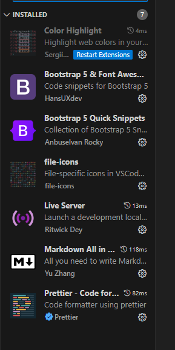
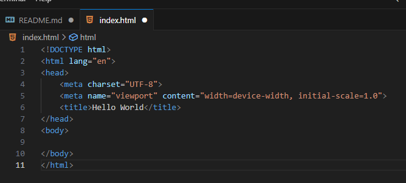
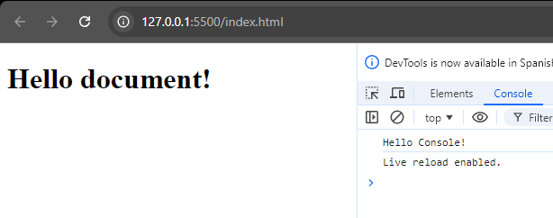
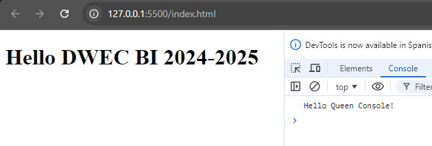
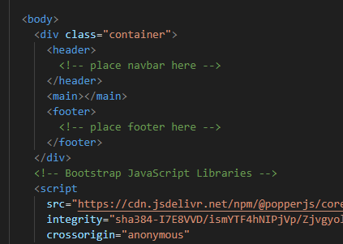
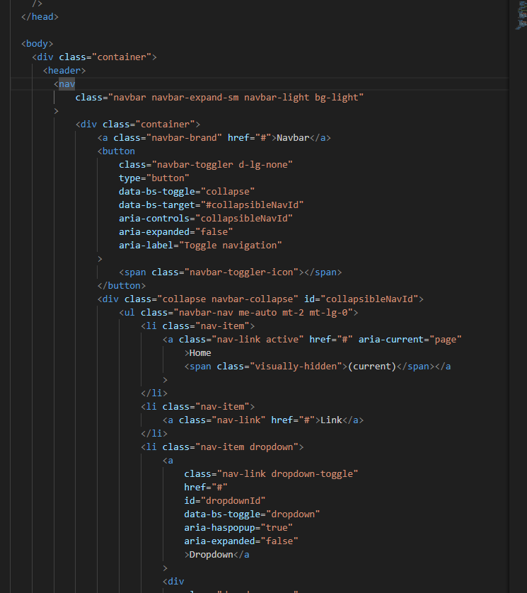
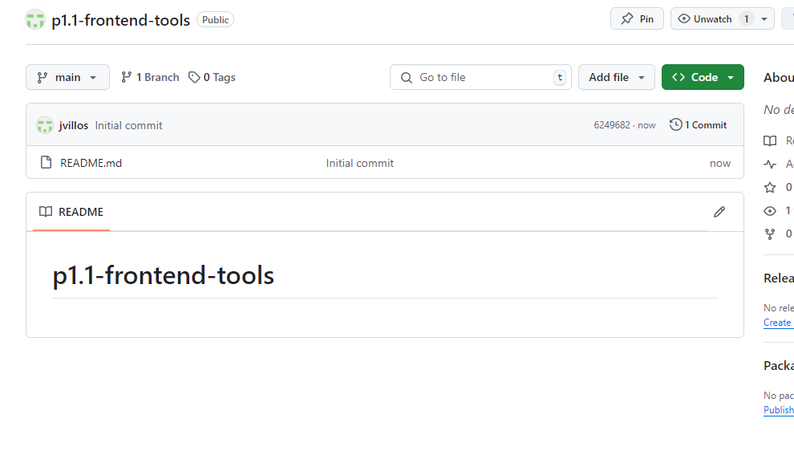

# Practice 1.1 - Installing and configuring Web Development Tools

### 2DAW - DWEC Bilingual. 

> **Student Name**:  Juan Villoslada Jiménez

#### Files included in this repository:

Ennumerate and explain each one of the files included in this repo.

- File 1
- File 2
- Etc...

#### Instructions: 

- Fill your name and lastname and answer the questions in the current `README.md` file. You have to submit the activity as a GitHub repo link that has to include the 

- You can add images to this tocument with the syntax:

    ```md
    
    ```

- Any other question about Markdown language you can find in the [Markdown Cheat Sheet](https://www.markdownguide.org/cheat-sheet/)

### Install and configure VSCode

1. **Install `VSCode` in your computer**.

I have already installed it

2. **Create a new folder called `p1.1-frontend-tools`and open it as a workspace in VSCode. Copy the current `README.md` inside it**.

Task done

3. **What functionalities do the following VSCode extensions add?**
   - **Bootstrap 5 quick Snippets**
        - It makes shortcuts to write code faster with Bootstrap 5, autocompleting sentences.
   - **Live Server**
        - It makes a reflection of the webpage you are coding in a live server (browser)
   - **Prettier**
        - IT provides a specific format for vscode with it's own style.
   - **Markdown All in One**
       -  It creates keyboard shortcuts for different functions

   

4. **Install the extensions listed in the previous point in VSCode**.

 


5. **What other extensions do you know that you consider interesting for developing in JavaScript**?
      - file-icons is another useful vscode extension, providing file icons to every file.
6. **Find in VSCode the option in `Settings` to `Format On Save` and activate it. What effect has this option?**
    - It formats the document (intentation) in clear blocks every time you save
### Create a Hello World in JS

7. **Create an `index.html` file inside your worspace folder.**
8. **Create the basic html structure using the `!` snippet and change the title to 'Hello World'**

    ````html
    <!DOCTYPE html>
    <html lang="en">
    <head>
      <meta charset="UTF-8">
      <meta name="viewport" content="width=device-width, initial-scale=1.0">
      <title>Hello World</title>
    </head>
    <body>
      
    </body>
    </html>
    ````

    

9. **Create a new file called `app.js` and add this two lines**

    ````javascript
    console.log("Hello Console!")
    document.body.innerHTML = "<h1>Hello document!<h1>"
    ````

10. **Import the script in your html using one of the techniques explained in class. Explain here the technique, show the code and justify why did you choose this technique**.


-   I used this technique because the .js was already created, so it made the more sense than typing the code again. It could also have been placed in the <head> tag.


11. **Launch `index.html` in Live Server and check that the script is running. Click right button and select inspect to show the developer tools and take a look on the console.**
    
    

12. **Change some message in the JS code and sava changes. You can check that Live Server refreshes the web page.**


### Create a simple form with Bootstrap 4. 

13. **At this point, we are going to create a page called `form.html` starting from the `Bs5-$` template provided by the Bootstrap extension we added. What files does this template import in the html by default?**

      - The template imports bootstrap stylesheets in the tag like (href) and the bootstrap JavaScript libraries after the footer in the body

14. **Create a `<div>`with the class `.container` to wrap all the sections in the web page**


  
15. **Add a standard navigation bar inside the nav area using the `bs5-navbar-standard` snippet inside the container**



-   I used the navbar-default snippet (bs5-navbar-standard wasn't available)

16. **Inside the main area create a form using Bootstrap to collect data from a new user who wants to register at an academy that offers courses. We can copy code from [Bootstrap Documentation](https://getbootstrap.com/docs/5.0/forms/overview/)**. 


### Install Git, and upload your project to GitHub

17. **Install [git](https://git-scm.com/) in your computer**.
Done
    
18. **Init the git project**
    
    
19. **Log in to your GitHub account provided by IES Azarquiel**
Done
    
20. **Follow the teacher on GitHub at the following link: [https://github.com/jeatzr/](https://github.com/jeatzr/)**
Done
    
21. **Create a new empty project on GitHub named `p1.1-frontend-tools`.**

    
22. **Follow the instructions in the command line provided by GitHub to add your files, create the first commit and push it. Notice that in out case we have to add all files to the staged area with `git add .`, not just`git add README.md`** 

Git commands to push the files to GitHub:


Final results:


    
23. **To finish, submit the link of your GH repo to the task in our Classroom.**
# p2.1-js-fundamentals


